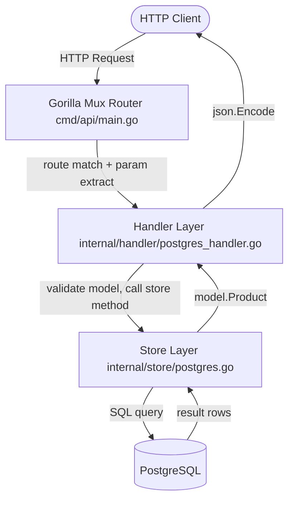
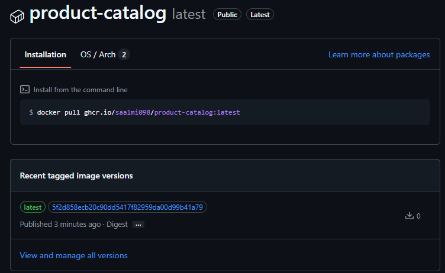

# CDMA Exercise 2: SALMINGER

## Task 1: Architecture

### Request Flow Diagram

### MemoryStore vs PostgresStore

#### Key differences

| | MemoryStore | PostgresStore |
|--|-------------|---------------|
| Data Persistence | Lost on restart | Survives restarts |
| Disk Space | None (RAM only) | 100-300 MB for PostgreSQL install + space for stored data |
| Dependencies | None | Running PostgreSQL |
| Concurrency | RWMutex (single process only) | DB handles it, multi-instance safe |
| Performance | Fastest (RAM) | Network + disk I/O |
| Scale | Single process, limited by RAM | Multiple app instances, large datasets |
| Health check | Always OK | Pings DB (`db.Ping()`) |

**When to use MemoryStore:**
- Fast, local development without Docker/DB setup
- Unit tests that don't need persistence
- Demos, prototypes, quick experiments

**When to use PostgresStore:**
- Production (data must survive restarts)
- Multiple app instances (containers, replicas) sharing state
- Datasets larger than available RAM
- Any real deployment...

#### How selection works

`cmd/api/main.go` — if `DB_HOST` env var is set --> PostgresStore, else --> MemoryStore. 

## Task 2: GitHub Actions Workflow

Working CI pipeline:

TODO

### Docker Image in Container Registry

Docker Image pushed to GitHub Container Registry on main:

https://github.com/saalmi098/cd-mcm-exercise-Salminger/pkgs/container/product-catalog

