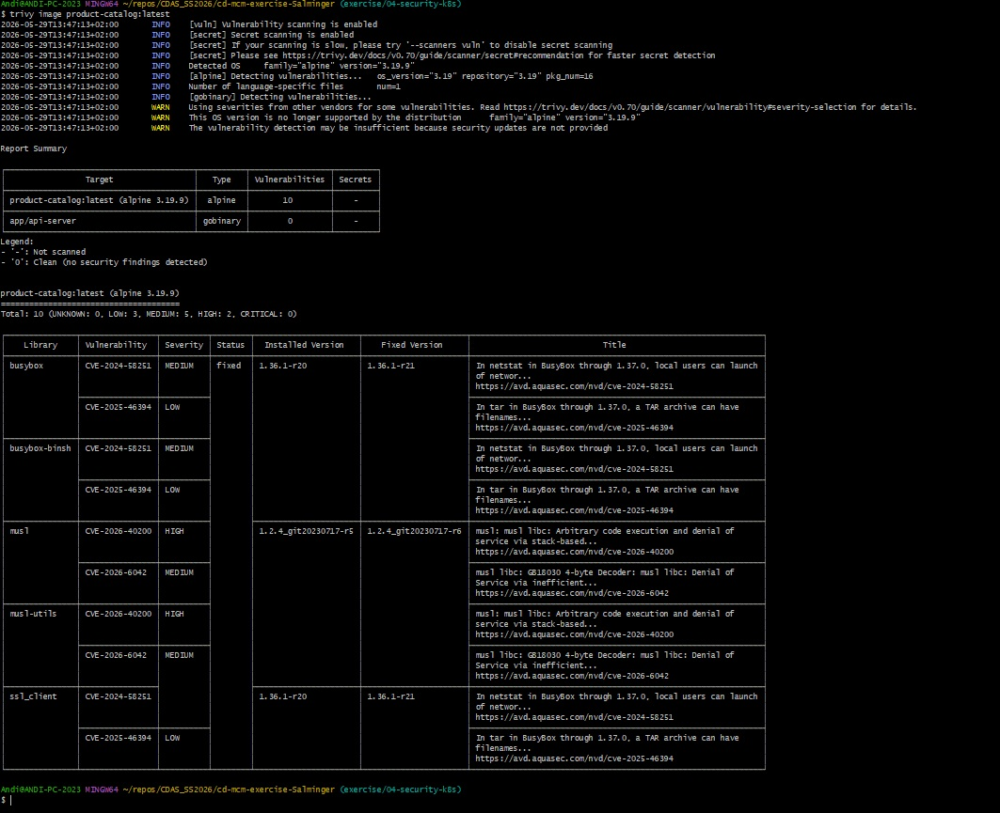
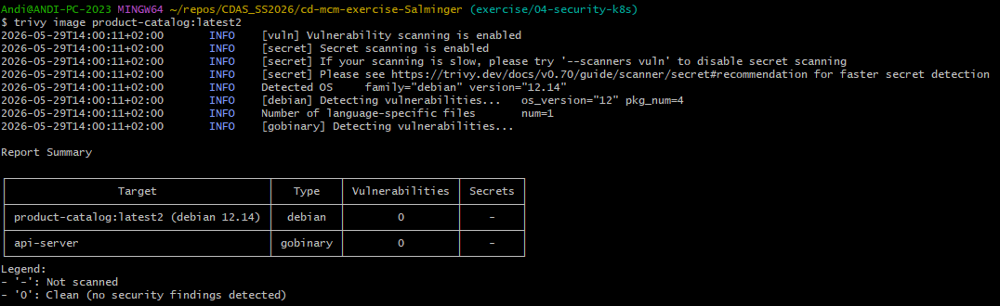
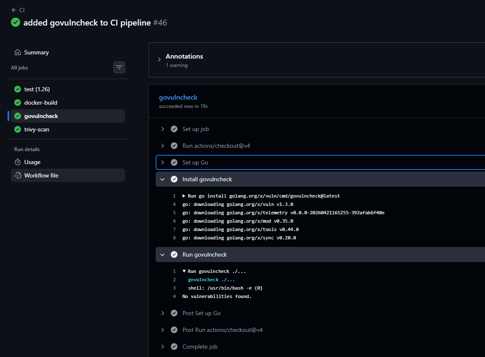

# CDMA Exercise 4: SALMINGER

## Task 1: Docker Image Scanning

### Before (alpine:3.19)

Total: 10 vulnerabilities — CRITICAL: 0, HIGH: 2, MEDIUM: 5, LOW: 3



All 10 from `alpine:3.19` base (busybox, musl, ssl_client). Go binary: 0 vulns.

### Optimization: Switch to distroless

Changed runtime base to `gcr.io/distroless/static-debian12` — no shell, no package manager, no busybox/musl.

### After (distroless/static-debian12)

Total: 0 vulnerabilities



### CI: Trivy Scan Job

Trivy report artifact: [https://github.com/saalmi098/cd-mcm-exercise-Salminger/actions/runs/26636398636/artifacts/7290317405](https://github.com/saalmi098/cd-mcm-exercise-Salminger/actions/runs/26636398636/artifacts/7290317405)

## Task 2: Dependency Scanning

### Scan Output

```
=== Symbol Results ===

Vulnerability #1: GO-2026-4971
    Panic in Dial and LookupPort when handling NUL byte on Windows in net
  More info: https://pkg.go.dev/vuln/GO-2026-4971
  Standard library
    Found in: net@go1.26.2
    Fixed in: net@go1.26.3
    Example traces found:
      #1: internal/store/postgres.go:53:15: store.PostgresStore.GetAll calls sql.Rows.Next, which eventually calls net.Dialer.Dial
      #2: internal/store/postgres.go:53:15: store.PostgresStore.GetAll calls sql.Rows.Next, which eventually calls net.Dialer.DialContext
      #3: cmd/api/main.go:51:31: api.main calls http.ListenAndServe, which eventually calls net.Listen

Your code is affected by 1 vulnerability from the Go standard library.
This scan also found 2 vulnerabilities in packages you import and 5
vulnerabilities in modules you require, but your code doesn't appear to call
these vulnerabilities.
```

### CVE Analysis

| ID | Severity | Package | Found | Fixed | Status |
|----|----------|---------|-------|-------|--------|
| GO-2026-4971 | HIGH | `net` (stdlib) | go1.26.2 | go1.26.3 | Fixed |


### Resolution

Added `toolchain go1.26.3` to `go.mod` to pin Go toolchain to patched version.

### CI: govulncheck Job

After fixing go.mod:

