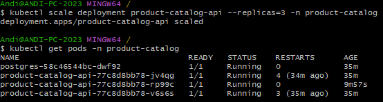
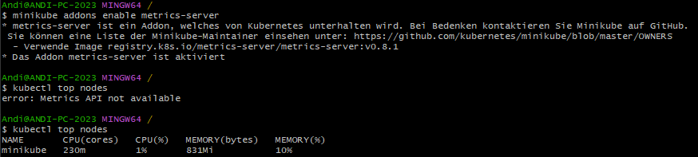

# Kubernetes: Health Checks & Resource Limits

## Health Checks

### Readiness vs Liveness Probe

| | Readiness | Liveness |
|---|---|---|
| **Question** | "Is this pod ready to serve traffic?" | "Is this pod still alive?" |
| **On failure** | Pod removed from Service endpoints - no traffic routed to it | Pod killed and restarted |
| **Use case** | Slow startup, DB not yet connected, warming up | Deadlock, infinite loop, crashed but process still running |

**In this deployment (`api-deployment.yml`):**

```yaml
readinessProbe:
  httpGet:
    path: /health
    port: 8080
  initialDelaySeconds: 5   # check after 5s
  periodSeconds: 10

livenessProbe:
  httpGet:
    path: /health
    port: 8080
  initialDelaySeconds: 15  # check after 15s
  periodSeconds: 20
```

### Why different `initialDelaySeconds`?

- **Readiness: 5s** - check early so pod joins the load balancer as soon as it's ready.
- **Liveness: 15s** - must wait longer than startup time. If liveness fires before the app finishes starting, K8s kills the pod in a restart loop.

### What happens when each probe fails?

**Readiness fails:**
- Pod stays Running but is marked `NotReady`
- Removed from Service endpoints → no new requests reach it
- Existing connections are drained
- Pod is NOT restarted - it recovers on its own when `/health` returns 200 again

**Liveness fails:**
- kubelet kills the container
- Container restarts per `restartPolicy` (default: `Always`)
- If it keeps failing: exponential backoff → `CrashLoopBackOff`

---

## Resource Limits

### Configuration in this deployment

```yaml
resources:
  requests:
    memory: "64Mi"
    cpu: "100m"
  limits:
    memory: "128Mi"
    cpu: "250m"
```

### What happens when limits are exceeded?

**CPU limit exceeded:**
- Container is **throttled** (CPU cycles are capped)
- Process is not killed - just slowed down
- `cpu: "250m"` = max 25% of one core

**Memory limit exceeded:**
- Container is **OOMKilled** (killed immediately by kernel)
- K8s restarts the container
- Visible as `OOMKilled` in `kubectl describe pod`

### Why specify both requests and limits?

| | Requests | Limits |
|---|---|---|
| **Purpose** | Scheduling hint - how much the pod *needs* | Hard cap - how much it *can use* |
| **Used by** | kube-scheduler (node selection) | kubelet / kernel (enforcement) |
| **Without requests** | Scheduler places pod on any node, may overcommit | - |
| **Without limits** | - | Pod can consume all node memory → OOM kills other pods |

**Requests** guarantee the pod lands on a node with sufficient capacity.  
**Limits** protect the node and other pods from a runaway container.

---

## Screenshots

### Pods running



### Resource usage


